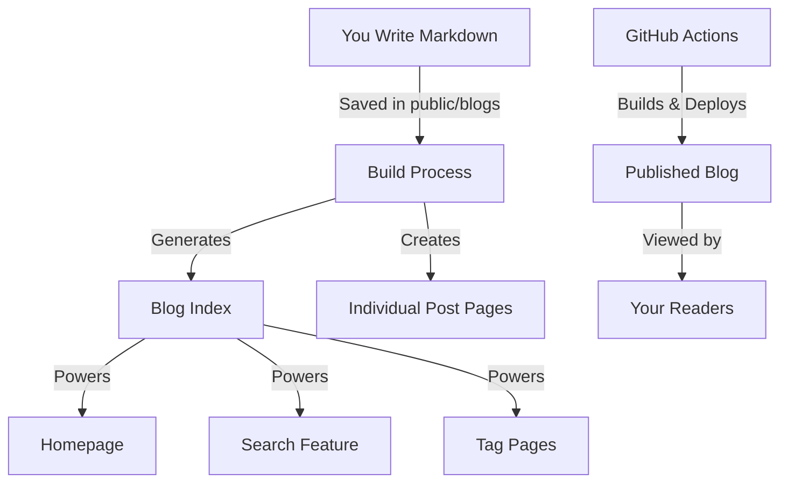
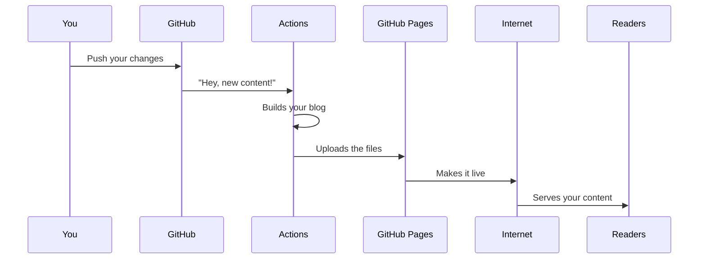
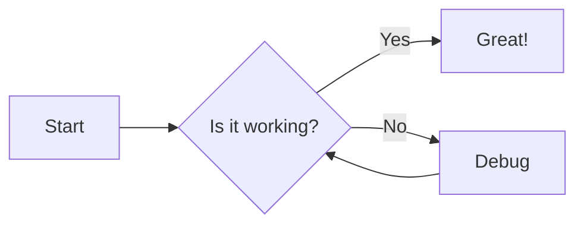

# Next.js Blog Framework

A production-ready, modern blog framework built with Next.js 15, React 19, and Tailwind CSS 4. Features markdown support, dark mode, search functionality, and automated deployment.

## Features

- ✨ **Modern Stack**: Next.js 15 with App Router, React 19, TypeScript
- 📝 **Markdown Support**: Write posts in markdown with frontmatter
- 🎨 **Responsive Design**: Mobile-first design with Tailwind CSS 4
- 🌙 **Dark Mode**: Built-in theme switching
- 🔍 **Full-text Search**: Client-side search functionality
- 🏷️ **Tag System**: Organize posts with tags and filtering
- ⏱️ **Reading Time**: Automatic reading time estimation
- 🖼️ **Image Support**: Optimized image handling
- 📊 **Diagrams**: Mermaid diagram support
- 🧮 **Math**: LaTeX equation rendering with KaTeX
- 🚀 **Fast Performance**: Static site generation with ISR
- 📱 **SEO Optimized**: Meta tags, OpenGraph, structured data
- 🔄 **Auto Deployment**: GitHub Actions CI/CD pipeline

## Quick Start

### Prerequisites

- Node.js 18+ 
- npm or yarn package manager
- Git

### Installation

1. **Clone the repository**
   ```bash
   git clone https://github.com/tristanpoland/Blog-Pages.git
   cd Blog-Pages
   ```

2. **Install dependencies**
   ```bash
   npm install
   ```

3. **Start development server**
   ```bash
   npm run dev
   ```

4. **Open your browser**
   Visit `http://localhost:3000` to see your blog

## Project Structure

```
├── src/
│   ├── app/              # Next.js App Router pages
│   ├── components/       # Reusable React components
│   └── utils/            # Utility functions
├── public/
│   └── blogs/            # Markdown blog posts
├── scripts/              # Build scripts
├── .github/workflows/    # CI/CD automation
└── package.json          # Dependencies and scripts
```

## Creating Content

### Blog Posts

Create markdown files in `public/blogs/` with frontmatter:

```markdown
---
title: "Your Post Title"
date: "2025-07-22"
tags: ["nextjs", "blog"]
excerpt: "Brief description of your post"
---

# Your Content Here

Write your blog post content using standard markdown syntax.
```

### Frontmatter Fields

- `title`: Post title (required)
- `date`: Publication date in YYYY-MM-DD format (required)
- `tags`: Array of tags for categorization
- `excerpt`: Brief description for previews

### Adding Images to Your Posts

Want to include some pictures? Easy! Just:

1. Add your image to the `public` folder
2. Reference it in your post like this:
   ```markdown
   
   ```

### Creating Code Examples

If you're writing about programming, you can add beautiful code blocks:

````markdown
```javascript
// This will look amazing in your blog
function sayHello() {
  console.log("Welcome to my blog!");
}
```
````

## How Your Blog Actually Works (Behind the Scenes)

Let's break down how everything works together - in plain English!

### The Content Journey

Your blog works like this:

1. **You Write Content**: You create markdown files in the `public/blogs` folder

2. **Processing Magic**: When you build your blog, special utilities in the `utils` folder read all your markdown files, extract information like titles and tags, and create a searchable index

3. **Beautiful Presentation**: React components in the `components` folder turn your markdown into beautiful HTML with proper styling

4. **Page Creation**: Next.js creates all the necessary pages - your homepage with a list of posts, individual post pages, search results pages, and tag pages

5. **Publishing**: When you're ready to share with the world, GitHub Actions automatically builds and publishes your blog

Here's how it looks as a diagram:



### The Deployment Magic

Whenever you push changes to your GitHub repository, something cool happens:



1. GitHub detects your changes
2. The workflow in `.github/workflows/deploy.yml` springs into action
3. It sets up the environment, installs dependencies, and builds your blog
4. The built files are automatically deployed to GitHub Pages
5. Your changes are live on the internet!

## Customizing Your Blog

Want to make this blog truly yours? Here are some easy ways to personalize it:

### Site Information

Open `app/layout.jsx` and change:
- The site title
- The site description
- The font choice (if you want)

### Look and Feel

The design uses Tailwind CSS, which makes styling super easy:
- Customize colors in `globals.css`
- Modify component layouts in their respective files
- Add your logo to the header

### Header and Footer

Edit these files to add your own links:
- `components/Header.jsx` - Add navigation links, your logo, etc.
- `components/Footer.jsx` - Add social media links, copyright info

## Publishing Your Blog to the World

Ready to go live? It's incredibly simple:

1. Enable github pages in the `settings` tab of your repo:


2. Push your changes to GitHub:
   ```bash
   git add .
   git commit -m "My blog is ready!"
   git push
   ```

3. The GitHub Actions workflow will automatically:
   - Build your blog
   - Deploy it to GitHub Pages

4. In a minute or two, your blog will be live at `https://yourusername.github.io/your-repo-name`

5. Share your blog link with friends, family, and social media!

### Troubleshooting Common Issues

If something doesn't look right:

- **Posts not showing up?** Check if your markdown frontmatter has the correct format
- **Weird styling?** Make sure your Tailwind classes are applied correctly
- **Deployment problems?** Check the Actions tab in your GitHub repository for error logs

## Advanced Blog Features

Once you're comfortable with the basics, try these cool features:

### Mermaid Diagrams

You can create interactive diagrams right in your posts:

````markdown

````

### Math Equations

Need to share some math? LaTeX equations work too:

```markdown
Inline equation: $E = mc^2$

Block equation:
$$
f(x) = \int_{-\infty}^{\infty} \hat{f}(\xi) e^{2\pi i \xi x} d\xi
$$
```

### Custom Containers

Create special highlighted sections:

```markdown
::: info
This is an info box with important details!
:::
```

## Wrapping Up

And there you have it - your very own blog platform that's modern, fast, and easy to maintain! We've designed this framework to grow with you, whether you're a casual blogger or a tech professional.

Remember, the best blog is the one you actually write for. So go ahead, share your thoughts, knowledge, and experiences with the world!

Happy blogging!

---

P.S. Found this helpful? Consider giving the project a star on GitHub, or even better, contributing back improvements so others can benefit too!
